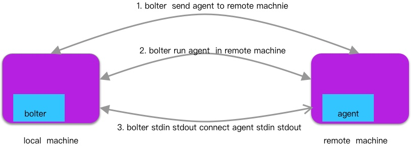
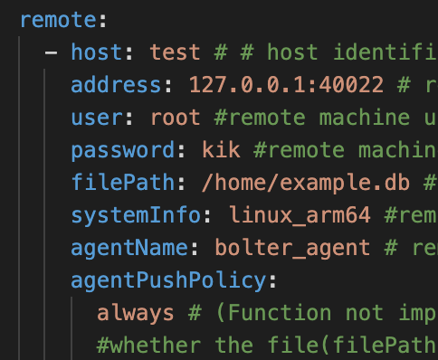
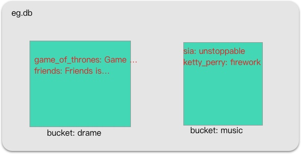
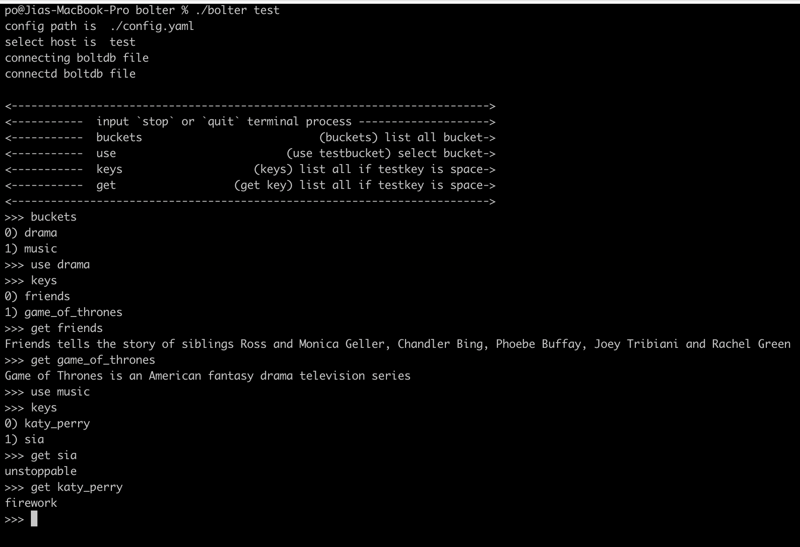

# Bolter
NOTE: Do not use the project in production. The agent may be read dirty data.

bolter is a remote access bolt file tool. multiple processes access boltdb file simultaneously.

agent is a client of boltdb file, have query bucket and keys function. even if the boltdb file has been open, agent can still access file, because agent delete the flock(system call).

agent has been embed into bolter， there are two version by default `linux_amd64` and   `linux_arm64`, if you remote machine is other platform you should manual build bolter to support your platform.



## How to use
```sh
bolter test
```

test is host tag
eg.db have two buckets, drama and music. drama bucket have two keys and music have tow keys, like fellow.


use like this:


## Quick install
```sh
go get -u github.com/papandadj/bolter
```

## Usage
bolter -h

## Configuration

```yaml
remote:
  - host: mydevice # host identification, a tag
    address: 172.24.107.72:22 # remote machine address, like 172.24.107.72:22
    user: po #remote machine username, like root
    password: pass #remote machine password
    filePath: /home/po/eg.db #remote machine file you want to view
    systemInfo: linux_amd64 #remote machine system information, like linux_amd64 linux_arm64 darwin_amd64 darwin_arm64
    agentName: bolter_agent # remote machine agent name, agent will be uploaded to the /tmp/{agentName}
    agentPushPolicy:
      always # (Function not implemented)agent uploaded policy, like  always ifNotPresent。 if ifNotPresent, bolter check
      #whether the file(filePath) on the remote machine, if it is not, is with send agent
```

1. check the environment variable `bolter_config`
2. check current directory `config.yaml`
3. check `$HOME/.config/bolter.yaml`

## how dose the agent work
Fix boltdb source code
1. delete flock 
2. delete cmd directory
3. if the remote file does not exit, do not create it
4. if the remote file is not mete pages, do not initialize now files with meta pages

## Manual install

1. download the code
2. build `bolter agent`, for example:
```sh
GOOS="linux" GOARCH="amd64" go build -o ./build/linux_amd64 agent/agent.go 
GOOS="linux" GOARCH="arm64" go build -o ./build/linux_arm64 agent/agent.go 
```

you can compile multiple agents for use on different machine platform.
3. build bolter
```sh
go build -o bolter bolter.go 
```
`bolter` will search `bolter agent` in build directory, therefore, the contents of part 2 cannot be changed

## test
copy test db into remote machine, my machine is docker container , use linux(ubuntu 20) and arm64 arch.
```sh
scp -P 40022 ./example/eg.db root@127.0.0.1:/home/example.db
```